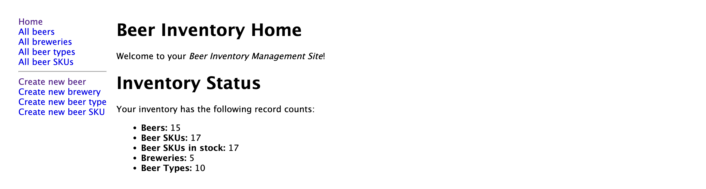
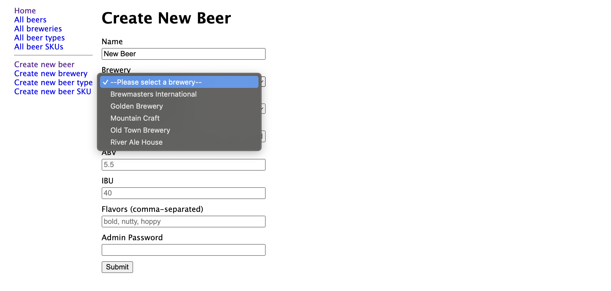
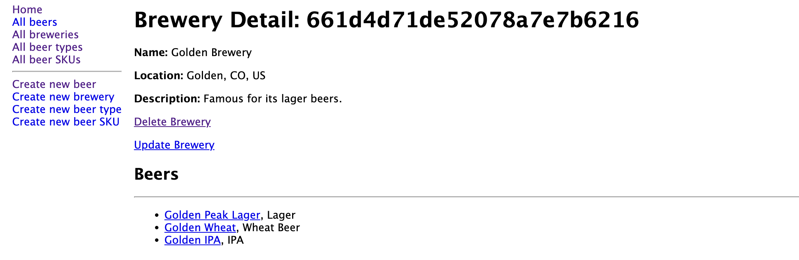
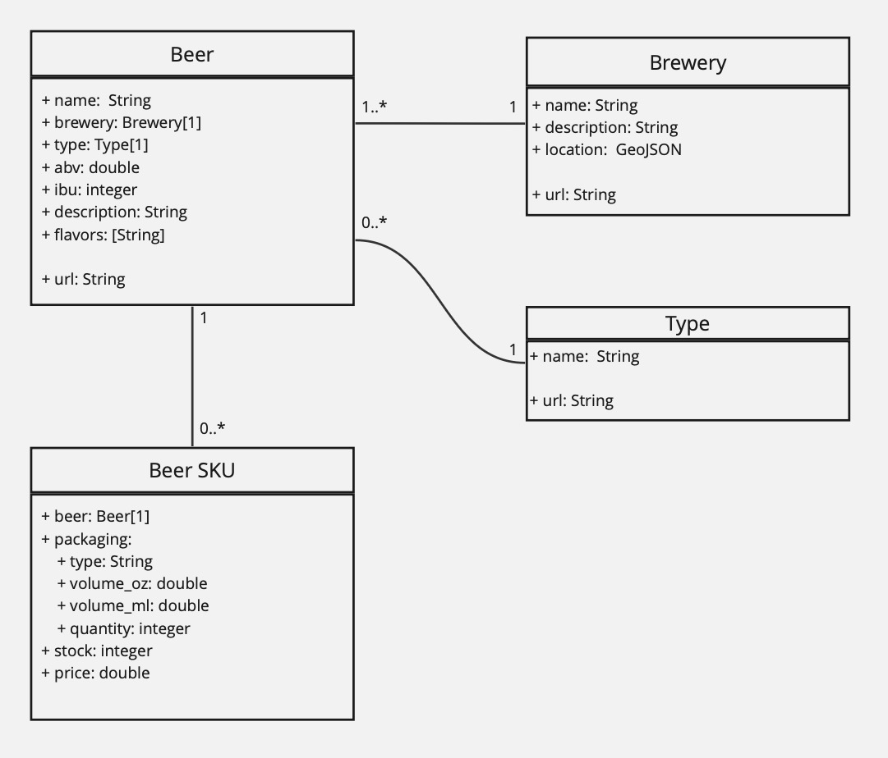

# Inventory Application

An application to manage and track inventory, particularly for beer merchants and their products.

## Description

This Inventory Application is designed to help beer merchants manage their inventory of different beer products. It provides features to add, update, delete, and view details of breweries, beer types, beers, and individual beer SKUs. The application is built using Node.js and Express, with a MongoDB database for storage.

## Table of Contents

- [Description](#description)
- [Screenshot](#screenshot)
- [Preview](#preview)
- [Features](#features)
- [Installation](#installation)
- [Usage](#usage)
- [Tech Stack](#tech-stack)
- [License](#license)
- [Contact Information](#contact-information)

## Screenshot

### Home Page



### Create New Beer Page



### Brewery Detail Page



## Preview

You can view a live preview of the page [here](https://inventory-application-bb.fly.dev).

## Features

- Comprehensive management of breweries, beer types, beers, and beer SKUs: add, update, delete, and view records.
- Uses [Country State City API](https://countrystatecity.in) to constrain location choices when creating new breweries.
- Admin password required to submit CRUD operations
- Server-side form sanitization and validation with express-validator
- Strong interconnectivity between data models with built-in safeguards.
- Dependency protections: prevent deletion of records with dependent data. For instance, a brewery with associated beers cannot be deleted until the beers are removed.
- Intuitive and user-friendly interface featuring easy-to-use forms and lists.

### Data Models



## Installation

1. Clone the repository:
   ```sh
   git clone https://github.com/sourdoughbredd/inventory-application.git
   ```
2. Navigate to the project directory:
   ```sh
   cd inventory-application
   ```
3. Install dependencies:
   ```sh
   npm install
   ```
4. Get an API KEY for [Country State City API](https://countrystatecity.in)
5. Create a .env file of the form:
   ```sh
   MONGODB_URI="your MongoDB connection string"
   LOCATION_API_KEY="your Country-State-City API key"
   ADMIN_PASS="an admin password of your choice"
   ```

## Usage

To start the application, run the following command:

```sh
npm start
```

The application will be available at `http://localhost:3000`.

## Tech Stack

- HTML / CSS / JavaScript
- NodeJS + Express
- MongoDB + Mongoose
- Pug (formerly Jade)
- Express-Validator

## License

This project is licensed under the MIT License.

## Contact Information

For any questions or suggestions, please contact Brett Bussell at [bwbussell24@gmail.com](mailto:bwbussell24@gmail.com).
